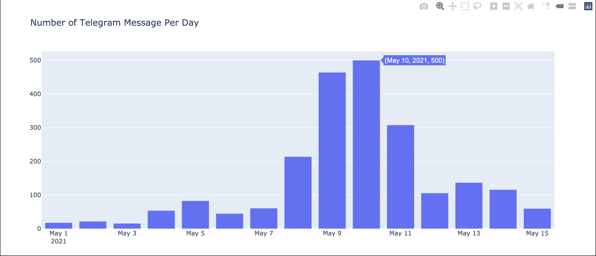
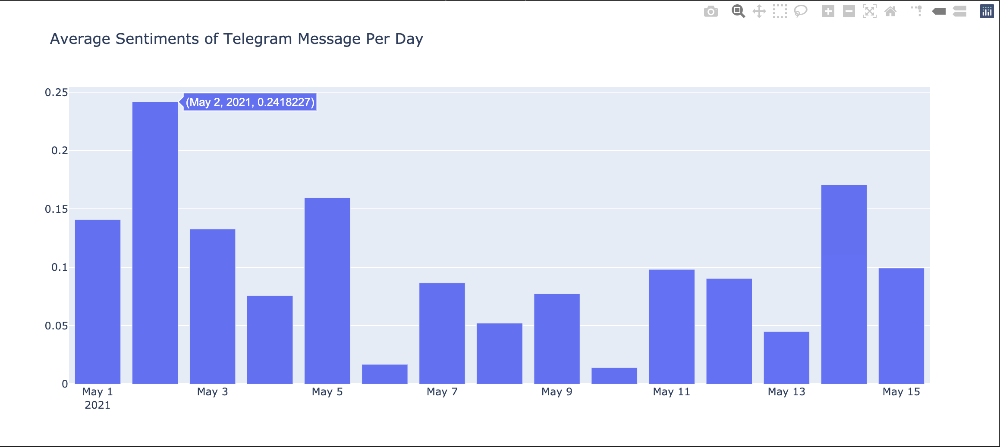

# Telegram Message Sentiment Analysis Visualization

## 0. Python Packages Installation
* Run the following commands in terminal to install dependent python libraries used in code

		`pip3 install -r requirements.txt`

		`python3 -m spacy download en`
	

## 1. Telegram Message Dataset
* The Telegram Message Data is collected from https://t.me/CryptoComOfficial. The messages are taken from May 1, 2021 to May 15, 2021(including).

* The exported data is stored in JSON File format which is available in `telegram.json`. This file should be in same directory as that of Python File.

## 2. Generating Visualization Plots for Sentiments of Telegram Messages
After the initial installation is successfully done. The sentiments generation and plot development procedure can be started by the following command:

	`python3 telegram_message_sentiment_analysis.py`

## 3. Summary of Results:

* The purpose of this task is to visualization the average sentiments score of Telegram Messages related to SHIB and DOGE over time.
* For this the messages are filtered by removing Non-English messages. Moreover, the messages related to SHIB and DOGE are extracted on which sentiment analysis is to be performed.
* I have used **VaderSentiment Analyzer** for generating sentiments of the messages. The major reason for using this sentiment analyzer is because we are expected to perform first analysis(inintial level analysis), so we don't require lot of information just the compound sentiment score and sentiment polarity. For advance analysis we can use Sentiment Analyzer by TextBlob which also provides the subjectivity ratio ranging from (0-1). Value near 0 means the sentiment is universal fact while value near 1 means sentiment is public opinion.
* There are 2 types of graphs that are plotted using **PLOTLY**.
	### 1. Number of Messages Per Day:-

	#### **Information Obtained**:- There is very high frequency of message from May 9 to May 11, these is because there is very high movement in the price of DOGE during this period.     Source(https://in.investing.com/crypto/dogecoin/historical-data)
	

	### 2. Average Sentiment Messages Per Day:-

	#### **Information Obtained**:- Average Sentiments of May 2 is more positive as compared to other days. The major reason is that the price of DOGE on May 1 is increased by approximately 16%. Moreover, DOGE has faced decrease of price by approximately 10% on May 9 hence the average sentiment for messages on May 10 is reduced and the polarity is moving towards negative sentiment. Similarly, SHIB has become very prominent between May 12 - May 14 has we can visualize sharp fluctuations in average sentiment values of those days.     Source 1(https://in.investing.com/crypto/dogecoin/historical-data) Source 2(https://in.investing.com/crypto/shiba-inu/historical-data)

	

 
